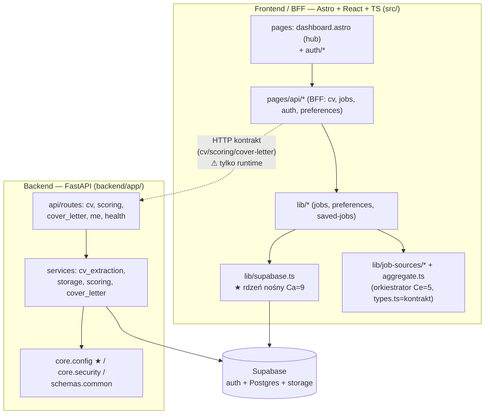

# Mapa projektu — `job-radar`

> Dokument onboardingowy dla nowego developera (i agenta) wchodzącego w to repo.
> Synteza trzech składowych Wide Scan: [terytorium](artifact-1-territory.md) · [struktura](artifact-2-structure.md) · [kontrybutorzy](artifact-3-contributors.md).
> **Okno dowodów: cała historia gita = ~2 tygodnie (2026-05-26 → 06-08), 124 commity, 1 człowiek-autor + agenci AI.** To mapa aktywności i struktury w tym oknie, nie ocena jakości.

## 1. TL;DR

`job-radar` to aplikacja do agregacji ofert pracy i dopasowania ich do CV z pomocą AI. Ma **dwa rdzenie**: frontend/BFF w **Astro + React + TypeScript** (`src/`) oraz usługę AI/CV w **Pythonie/FastAPI** (`backend/app/`), spięte przez kontrakt HTTP (cv / scoring / cover-letter) pilnowany testami kontraktowymi. Praca skupia się wokół `dashboard.astro` (hub produktu) i „korytarza CV" biegnącego przez 6 warstw i 2 języki. Graf importów frontendu jest **czysty (0 cykli)** z jednym stabilnym rdzeniem `src/lib/supabase.ts`; backend jest czysto warstwowy (`routes → services → schemas/core`). Boli najbardziej **granica frontend↔backend** — jest runtime (HTTP), więc żaden graf statyczny jej nie widzi, a jej kształt zmieniał się najczęściej. Uwaga: `job_radar/` to martwy scaffold Django — realny backend to FastAPI.

## 2. Teren — gdzie jest praca, gdzie peryferia

- **Duża odpowiedzialność (aktywne centra):** `backend/app` (51 dotknięć), `src/pages` (45), `src/lib` (31). Rdzeń = pipeline ofert + AI.
- **Hub produktu:** `src/pages/dashboard.astro` (15 zmian, najgorętszy plik) — spina jobs, scoring, preferences.
- **Głębokie centra grafu:** `src/lib/supabase.ts` (auth+DB, głęboki nośny), `src/lib/job-sources/aggregate.ts` (orkiestrator 4 źródeł).
- **Peryferia / martwe:** `job_radar/` — porzucony scaffold Django (w HEAD tylko `__pycache__`); drzewko katalogów tu kłamie.
- **Aktywność w czasie:** `unknown` — 2 tygodnie historii nie pozwalają odróżnić stałego centrum od kampanii MVP. Etykiety `stable/volatile/seasonal` niedostępne.

## 3. Realne powiązania — co naprawdę zmienia się razem

| Powiązanie | Skąd wiem | Waga |
|-----------|-----------|------|
| BFF `api/cv/upload.ts` ↔ backend `routes/cv.py` | **co-change gita** (3×) + `test_contracts.py` | wysoka — kontrakt runtime, niewidoczny w grafie importów |
| „Korytarz CV": endpoint → `cv_extraction` → `storage` → `schemas/cv` → migracja DB → BFF | co-change gita | wysoka — zmiana kształtu CV przechodzi przez ~6 warstw, 2 języki |
| `dashboard.astro` → `jobs.ts` / `score-batch.ts` / `preferences.ts` | co-change gita (5×/4×) | średnia — hub ciągnie logikę produktu |
| `job-sources/*` → `types.ts` (Ca=6) | **graf importów** | zdrowa inwersja — kontrakt jest fundamentem adapterów |
| wszystko → `supabase.ts` (Ca=9) | **graf importów** | wysoka — zmiana kontraktu = szeroki blast radius |
| frontend ↔ backend jako całości | 7 commitów dotyka obu | — |
| cykle importów | graf: **0 w `src/`**; backend = `unknown` (brak grafu Pythona) | brak splątań we froncie |

## 4. Strefy ryzyka (4–6 obszarów wysokiego ryzyka)

1. **Kontrakt frontend↔backend (cv/scoring/cover-letter)** — runtime HTTP, niewidoczny statycznie; zmieniał się najczęściej; jedyna siatka to `test_contracts.py`. *Dotknij ostrożnie i uruchom testy kontraktowe.*
2. **`src/lib/supabase.ts`** — Ca=9, auth+DB; zmiana kontraktu rozlewa się na cały frontend.
3. **„Korytarz CV"** — 6 warstw / 2 języki na jedną zmianę kształtu danych; łatwo o desync backend↔front.
4. **`src/lib/job-sources/aggregate.ts`** — Ce=5, kruchy wobec zmian w każdym z 4 adapterów źródeł.
5. **`job_radar/` (Django leftover)** — ryzyko pomyłki „to jest backend"; zweryfikuj, że nic go nie referuje przed usunięciem.
6. **Runtime coupling ogółem** — env, feature flagi, Supabase RLS/migrations, kolejność routerów — poza zasięgiem grafu; `unknown`.

## 5. Kogo zapytać (adaptacja: to solowy projekt + agenci AI)

Brak drugiej osoby — jeden autor (`Sebastian Przesmycki`, 2 warianty nazwy, ~38 commitów współautorowanych przez Claude). **„Kogo zapytać" = „który folder zmiany przeczytać":**

| Strefa | Gdzie żyje uzasadnienie (`context/archive/`) |
|--------|----------------------------------------------|
| Kontrakt / testy granicy | `2026-06-06-testing-backend-api-hardening`, `2026-06-07-testing-astro-route-contracts` |
| Backend FastAPI (foundation) | `2026-06-02-python-cv-ai-service-foundation` (+ `research.md`) |
| CV upload/ekstrakcja | `2026-06-02-cv-upload-and-extraction` |
| Scoring | `2026-06-05-cv-based-job-scoring` |
| Cover letter | `2026-06-05-cover-letter-generation` |
| Agregacja ofert (najwięcej fixów) | `2026-06-01-first-live-job-source`, `-three-source-job-aggregation` |

## 6. Pierwszy dzień — 5–8 plików do przeczytania (w tej kolejności)

1. `README.md` + `AGENTS.md` — kontekst i reguły projektu.
2. `backend/app/main.py` — jak montują się routery FastAPI (mapa backendu w 40 liniach).
3. `src/lib/supabase.ts` — rdzeń nośny auth+DB (Ca=9), wszystko przez niego przechodzi.
4. `src/pages/dashboard.astro` — hub produktu; zobacz, co spina.
5. `backend/tests/test_contracts.py` — kontrakt frontend↔backend jako wykonywalna specyfikacja.
6. `src/pages/api/cv/upload.ts` + `backend/app/api/routes/cv.py` — czytaj razem: jeden kontrakt, dwie strony.
7. `src/lib/job-sources/aggregate.ts` + `types.ts` — jak działa agregacja źródeł ofert.
8. `context/archive/2026-06-02-python-cv-ai-service-foundation/research.md` — „dlaczego" backendu.

## 7. Ograniczenia — czego ta mapa NIE mówi

- **Okno czasowe:** ~2 tygodnie. Brak wymiaru „stałe vs sezonowe"; wszystkie sygnały aktywności to jedna faza MVP.
- **Metoda:** aktywność z gita + graf importów **tylko JS/TS** (`dependency-cruiser`) + light grep-scan backendu. **Backend Pythona nie ma prawdziwego grafu** — jego cykle/coupling to `unknown` (dograj `pydeps`/`Tach` w Deep Focus).
- **Runtime niewidoczny:** kontrakt HTTP frontend↔backend, DI/env/feature flagi, Supabase RLS, webhooki, codegen — graf statyczny ich nie pokaże.
- **Orphany** `saved-jobs.ts`/`job-scores.ts`/`cv-profile.ts` to najpewniej artefakt parsowania `.astro`, nie martwy kod (`needs verification`).
- **Kontrybutorzy:** jeden człowiek → mapa „ukrytej wiedzy zespołu" nie ma zastosowania; wiedza jest w `context/changes|archive/*/`.
- To mapa **do decyzji, nie ocena jakości** — mówi „gdzie uważać i od czego zacząć", nie „co jest dobrze/źle napisane". To zadanie dla Deep Focus (M4L3).
